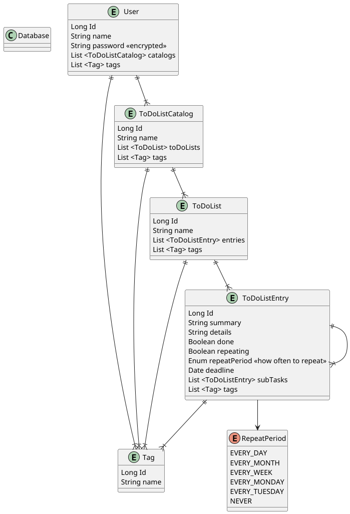

# 📝 ToDo List API

## Description
This is a backend API for a Todo List application. Users can create multiple todo list catalogs, manage todo list entries and assign tags for filtering. 
The API is secured using JWT authentication.

## Contributors
- Sara Kluge
- Dmitrii Sapelkin
- James Lind
- Hugo Leijonhufvud
- Lena Nordström


---

## ⚙️ How to use

### ▶️ Run Locally
1. Clone the repository:
```bash
git clone https://github.com/Basta-Gruppen-Java-2025-kurs/todo-appen.git
```
2. Create an environment file
3. Configure environment variables in `.env`:
```env
TODO_USER=root
TODO_PASSWORD=yourpassword

JWT_SECRET=THIS_IS_A_32_CHAR_MINIMUM_SECRET_KEY_PUT_YOURS_HERE
```
4. Run the application with **Maven**:
```bash
mvn spring-boot:run
```

Note: if you are using **MariaDB** instead of **MySQL**, run the app this way:
```bash
mvn spring-boot:run -Pmariadb
```

### ▶️ Run with Docker
1. Make sure **Docker** is installed.
2. To *build and start* containers, run this from the project's root folder:
```bash
docker compose up -d --build
```
3. To *stop* running containers, run this from the project's root folder:
```bash
docker compose down
```

---

## 🧩 Structure

### Endpoints
### 🔐 Authentication (`/auth`)

| Method | Endpoint | Description |
|------|---------|-------------|
| POST | `/auth/login` | Login with username & password, returns JWT |
| POST | `/auth/logout` | Logout (invalidate JWT) |
| GET  | `/auth/me` | Test endpoint for authenticated user |

**Login request body**
```json
{
  "username": "Alice",
  "password": "password123"
}
```
### 👤 Users ( `/users` )

| Method | Endpoint | Description |
|------|---------|-------------|
| POST | `/users` | Create a new user |

**Create user request body** 
```json
{
  "username": "Alice",
  "password": "password123"
}
```

### 📁 Catalogs (`/catalogs`)

| Method  | Endpoint                  | Description                 |
|---------|---------------------------|-----------------------------|
| POST    | /catalogs                 | Create a catalog for a user |
| GET     | /catalogs?userId={userId} | Get all catalogs for a user |
| DELETE  | /catalogs/{catalogId}     | Delete a catalog            |

**Create catalog (request params):**
POST /catalogs?userId=1&name=Work

### 📝 ToDo Lists (`/list`)

| Method | Endpoint | Description                                                               |
|------|---------|---------------------------------------------------------------------------|
| GET  | /list | Without parameters &mdash; get all todo lists                             |
| GET  | /list?userId=1&catalogId=1&filter=pattern&tags=one,two,three | With parameters: search by criteria |
| GET  | /list/{id} | Get a specific todo list by id                                            |
| POST | /list | Create a new todo list                                                    |
| PATCH | /list/{id}/rename | Rename a todo list                                                        |
| DELETE | /list/{id} | delete a list         |

**Create todo list (request body)**
```json
{
  "name": "Backend tasks",
  "userId": 1,
  "catalogId": 1
}
```

**Rename todo list (request body)**
```json
{
  "name": "New Name"
}
```

**Search by criteria**

To search by criteria, use `GET` with `/list` endpoint with any combination of the following parameters in the URL:

| Parameter | Usage |
|-----------|-------|
|
Examples:

`GET /list?/list?userId=1&catalogId=1&filter=pattern` &mdash; search for all lists that belong to the user with id=1 that are in catalog with id=1, and the list name contains the substring "pattern".

`GET /list?/list?tags=one,two,three` &mdash; search for all lists that have these 3 tags: "one", "two", "three"

### ✅ ToDo List Entries (`/lists/{listId}/entries`)

| Method | Endpoint | Description                                   |
|--------|---------|-----------------------------------------------|
| GET    | /lists/{listId}/entries | Get all entries (including subtasks) of a list |
| POST   | /lists/{listId}/entries | Create a new entry in a list                  |
| DELETE | /entries/{entryId} | Delete an entry by id                         |
| PATCH  | /entries/{entryId} | Update the done status of an entry by id      |
| PUT    | /entries/{entryId} | Update an entry by id                         |

**Create entry (request body)**  
Include the parent’s ID if the entry is a subtask.

```json
{
  "summary": "Implement API",
  "details": "Create controller and service",
  "deadline": "2026-01-30",
  "parentId": null
}
```
**Update done (request body)**

```json
{
  "done": true
}
```
**Update entry (request body)**

```json
{
  "summary": "Implement API",
  "details": "Create controller, service and repository",
  "done": true,
  "deadline": "2026-01-30"
}
```

### Class Diagram



---

## 🧪 Testing
Run all tests using Maven:
```bash
mvn test
```

---

## Branch Naming Policy
To maintain a clean and organized Git workflow, all branches must follow a standard naming convention.
The `main` branch is protected and should not be uesed for direct development.

### ✔️ Allowed Patterns 
- `feature/<description>` - new features
- `task/<description>` – smaller tasks
- `fix/<description>` – minor code fixes or adjustments
- `bug/<description>` – bug fixes

### Example of Valid Branch Names
- `feature/initial-setup`
- `task/add-readme`
- `fix/code-formatting`
- `bug/login-error`
